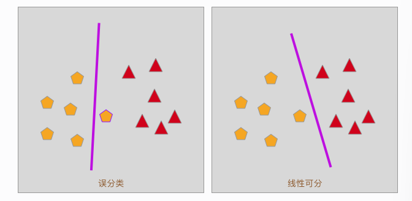

# 感知机是什么
感知器（英语：Perceptron）是 Frank Rosenblatt 在 1957 年就职于 Cornell 航空实验室时所发明的一种人工神经网络。它可以被视为一种最简单形式的前馈神经网络，是一种二元线性分类器。

在二分类模型中，我们最终的类别是由两个，被称之为正类别和负类别。我们使用以下Sign公式完成分类时
$$
\operatorname{sign}(x)=\left\{\begin{array}{ll}+1,&\text{ if} x\geq 0\\ -1,&\text{ if} x<0\end{array}\right.
$$
Sign函数又被称之为符号函数，它的函数值只有两个。即自变量x≥0时，因变量为1。函数图像如下：

所以在这个函数中，当 \(\operatorname{sign}(f(x))=1\) 时，就为正分类点
因此，我们不难得出，感知机的分类函数为
$$
\operatorname{f}(x)={sign}{(W*x+b)}
$$
这个函数就是感知机函数
流程图如下

# 感知机的损失函数
在感知机的学习过程中，我们同样需要确定每一个特征变量对应的参数，二损失函数的极小值往往就意味着参数的最佳值

在感知机的学习过程中，可能会出现误分类的问题
